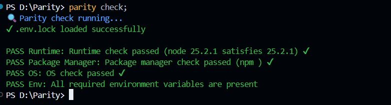
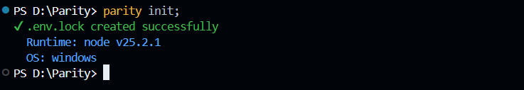
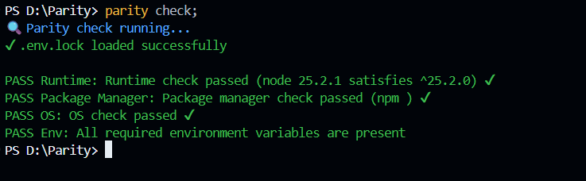
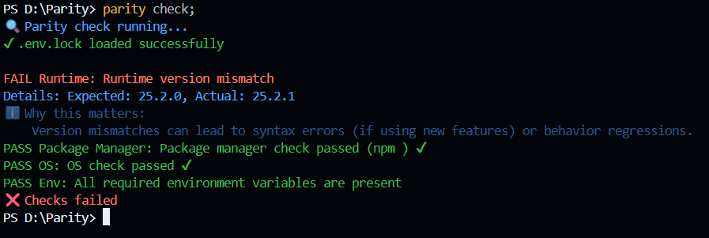
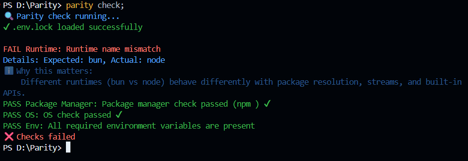
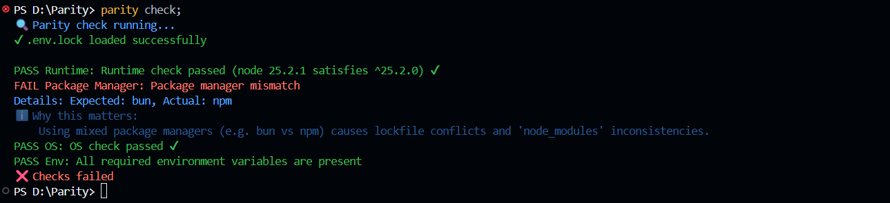
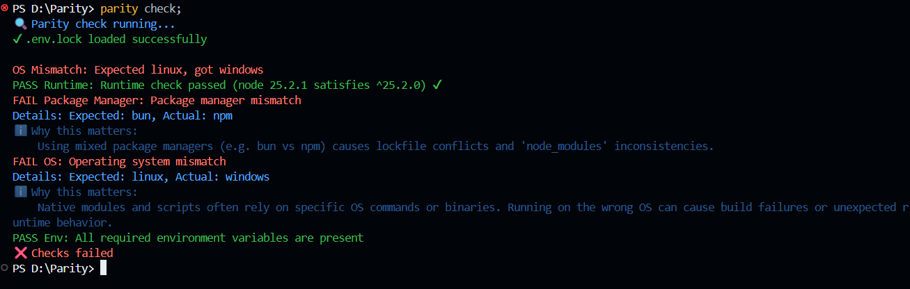
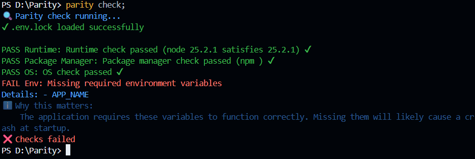
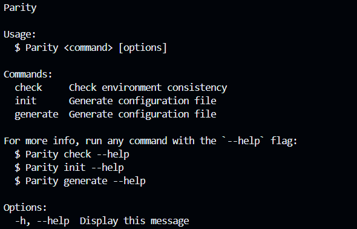

<div align="center">


# 🚀 Parity CLI

### Stop "It works on my machine" — Enforce environment consistency across your team and CI

[](https://www.npmjs.com/package/parity-ci)
[](https://opensource.org/licenses/MIT)
[](https://www.npmjs.com/package/parity-ci)

[Installation](#-installation) • [Quick Start](#-quick-start) • [Features](#-features) • [Documentation](#-documentation) • [CI/CD](#-cicd-integration)

</div>

---

## 🎯 What is Parity?

**Parity** is a zero-config developer experience tool that ensures every engineer on your team—and your CI pipeline—runs the exact same environment configuration. Say goodbye to:

- ❌ Runtime version mismatches
- ❌ Missing `.env` variables
- ❌ Package manager conflicts
- ❌ "Works on my machine" bugs

<div align="center">



</div>

---

## 📦 Installation

Choose your preferred package manager:

<table>
<tr>
<td> <b>npm</b> </td>
<td> <b>pnpm</b> </td>
<td> <b>bun</b> </td>
</tr>
<tr>
<td>

```bash
npm install -D parity-ci
```

</td>
<td>

```bash
pnpm add -D parity-ci
```

</td>
<td>

```bash
bun add -d parity-ci
```

</td>
</tr>
</table>

---

## 🚀 Quick Start

### Step 1: Initialize Configuration

Generate a `.env.lock` file based on your current environment:

```bash
npx parity init
```

<details>
<summary>📸 See what it looks like</summary>



</details>

### Step 2: Add to Your Workflow

Integrate Parity checks into your `package.json` scripts:

```json
{
  "scripts": {
    "postinstall": "parity check",
    "dev": "parity check && next dev",
    "build": "parity check && next build"
  }
}
```

### Step 3: Commit & Share

```bash
git add .env.lock
git commit -m "Add Parity configuration"
git push
```

Now every team member and CI run will validate against the same environment! 🎉

---

## ⚡ Features

### 🔧 Runtime & Version Enforcement

Ensure everyone uses the same Node/Bun version with support for strict versions or SemVer ranges.

<details>
<summary>✅ Success with SemVer Range</summary>



</details>

<details>
<summary>❌ Version Mismatch Detected</summary>



</details>

<details>
<summary>❌ Wrong Runtime Detected</summary>



</details>

---

### 📦 Package Manager Integrity

Stop mixed usage of `npm`, `pnpm`, `yarn`, and `bun` across your team.

<details>
<summary>❌ Package Manager Mismatch</summary>



</details>

---

### 🖥️ Cross-Platform Safety

Prevent platform-specific issues before they reach production.

<details>
<summary>❌ OS Compatibility Error</summary>



</details>

---

### 🔐 Environment Validation

Validate required `.env` variables before your application starts.

<details>
<summary>❌ Missing Environment Variables</summary>



</details>

---

### 📂 Multiple Env Files

Load environment variables from multiple files (e.g., `.env`, `.env.local`) with automatic overriding.

```yaml
envFiles:
  - .env
  - .env.local
```

---

### 📖 Helpful CLI

Built-in help commands to guide you through setup and usage.

<details>
<summary>🆘 Help Command Output</summary>



</details>

---

## 🤖 CI/CD Integration

### GitHub Actions

Add Parity to your CI pipeline with the `--ci` flag to treat warnings as errors:

```yaml
name: CI

on: [push, pull_request]

jobs:
  test:
    runs-on: ubuntu-latest

    steps:
      - uses: actions/checkout@v3

      - name: Setup Node.js
        uses: actions/setup-node@v3
        with:
          node-version: "18"

      - name: Install dependencies
        run: npm install

      - name: Run Parity checks
        run: npx parity check --ci

      - name: Run tests
        run: npm test
```

### GitLab CI

```yaml
test:
  stage: test
  script:
    - npm install
    - npx parity check --ci
    - npm test
```

### CircleCI

```yaml
version: 2.1

jobs:
  test:
    docker:
      - image: cimg/node:18.0
    steps:
      - checkout
      - run: npm install
      - run: npx parity check --ci
      - run: npm test
```

---

## 📚 Documentation

| Document                                        | Description                        |
| ----------------------------------------------- | ---------------------------------- |
| [📘 Getting Started](./docs/getting-started.md) | Complete setup guide with examples |
| [⌨️ Command Reference](./docs/commands.md)      | Full CLI command documentation     |
| [🧪 Testing & Scenarios](./docs/testing.md)     | Test your Parity configuration     |
| [❓ FAQ & Troubleshooting](./docs/faq.md)       | Common issues and solutions        |

---

## 🛠️ Configuration Example

Here's what a `.env.lock` file looks like:

```json
{
  "runtime": {
    "name": "node",
    "version": ">=18.0.0"
  },
  "packageManager": "pnpm",
  "os": ["darwin", "linux"],
  "envFiles": [".env", ".env.local"],
  "env": {
    "required": ["DATABASE_URL", "API_KEY"],
    "optional": ["DEBUG"]
  }
}
```

---

## 🤝 Contributing

Contributions are welcome! Please feel free to submit a Pull Request.

1. Fork the repository
2. Create your feature branch (`git checkout -b feature/AmazingFeature`)
3. Commit your changes (`git commit -m 'Add some AmazingFeature'`)
4. Push to the branch (`git push origin feature/AmazingFeature`)
5. Open a Pull Request

---

## 📄 License

MIT © [Pawandasila](https://github.com/Pawandasila)

---

<div align="center">

**[⬆ back to top](#-parity-cli)**

Made with ❤️ by developers, for developers

</div>
